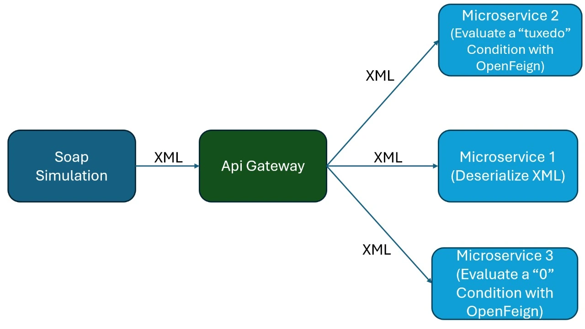

# SOAP SIMULATION

Este repositorio contiene una arquitectura de microservicios basada en Spring Boot, diseñada para simular el flujo de mensajes SOAP/XML a través de un API Gateway, con descubrimiento de servicios y deserialización de XML. Los proyectos incluidos son:

- [`soap-client-simulation`](soap-client-simulation/): Cliente que envía mensajes XML.
- [`api-gateway`](api-gateway/): Gateway que enruta las solicitudes a los microservicios.
- [`discovery-server`](discovery-server/): Servidor Eureka para descubrimiento de servicios.
- [`xml-deserializer`](xml-deserializer/): Microservicio que recibe y deserializa mensajes XML.

---

## Arquitectura




---

## Proyectos

### 1. soap-client-simulation

- **Descripción:** Cliente que envía mensajes XML a través del API Gateway.
- **Puerto:** 8081
- **Endpoint principal:** `POST /api/soap-receiver`
- **Funcionalidad:** Recibe un string XML y lo reenvía al API Gateway usando `RestTemplate`.

#### Ejemplo de uso

```bash
curl -X POST http://localhost:8081/api/soap-receiver \
  -H "Content-Type: application/json" \
  -d '{"messaggeBody": "<transaction>...</transaction>"}'
```

---

### 2. api-gateway

- **Descripción:** API Gateway basado en Spring Cloud Gateway. Enruta solicitudes a los microservicios registrados en Eureka.
- **Puerto:** 8082
- **Configuración de rutas:** Ver [`api-gateway/src/main/resources/application.yml`](api-gateway/src/main/resources/application.yml)
- **Descubrimiento:** Integrado con Eureka.

#### Ejemplo de ruta configurada

- `/api/transaction/receive` → Redirige a `xml-deserializer` (balanceo de carga vía Eureka).

---

### 3. discovery-server

- **Descripción:** Servidor Eureka para descubrimiento de servicios.
- **Puerto:** 8761
- **Acceso UI:** [http://localhost:8761](http://localhost:8761)
- **Funcionalidad:** Permite que los microservicios se registren y descubran entre sí.

---

### 4. xml-deserializer

- **Descripción:** Microservicio que recibe mensajes XML y los deserializa a objetos Java.
- **Puerto:** Dinámico (por defecto, asignado automáticamente)
- **Endpoint principal:** `POST /receive`
- **Funcionalidad:** Recibe XML, lo deserializa y responde con el estado de la operación.

#### Ejemplo de XML esperado

```xml
<transaction>
  <transactionId>123</transactionId>
  <guid>abc-456</guid>
  <payer>
    <name>Juan</name>
    <account>001122</account>
  </payer>
  <amount>100.00</amount>
  <currency>USD</currency>
  <beneficiary>
    <name>Maria</name>
    <account>334455</account>
  </beneficiary>
  <opcode>PAY</opcode>
</transaction>
```

---

## Ejecución local

1. **Clona el repositorio**  
   `git clone <url>`

2. **Arranca los servicios en este orden:**
   1. [`discovery-server`](discovery-server/)
   2. [`xml-deserializer`](xml-deserializer/)
   3. [`api-gateway`](api-gateway/)
   4. [`soap-client-simulation`](soap-client-simulation/)

3. **Prueba el flujo completo:**  
   Envía un mensaje XML desde el cliente y verifica que llegue al deserializer a través del gateway.

---

## Configuración de puertos

| Servicio               | Puerto |
|------------------------|--------|
| discovery-server       | 8761   |
| api-gateway            | 8082   |
| soap-client-simulation | 8081   |
| xml-deserializer       | 0 (dinámico, ver Eureka) |

---

## Tecnologías utilizadas

- Java 17
- Spring Boot 3.5.x
- Spring Cloud Gateway
- Spring Cloud Netflix Eureka
- Jakarta XML Bind (JAXB)
- Lombok

---

## Notas

- Todos los servicios usan Gradle para la construcción.
- El API Gateway utiliza balanceo de carga y descubrimiento de servicios vía Eureka.
- El microservicio `xml-deserializer` puede cambiar de puerto en cada arranque; consulta Eureka para ver el puerto asignado.
- El cliente SOAP envía el XML como string plano en el cuerpo de la petición.

---

